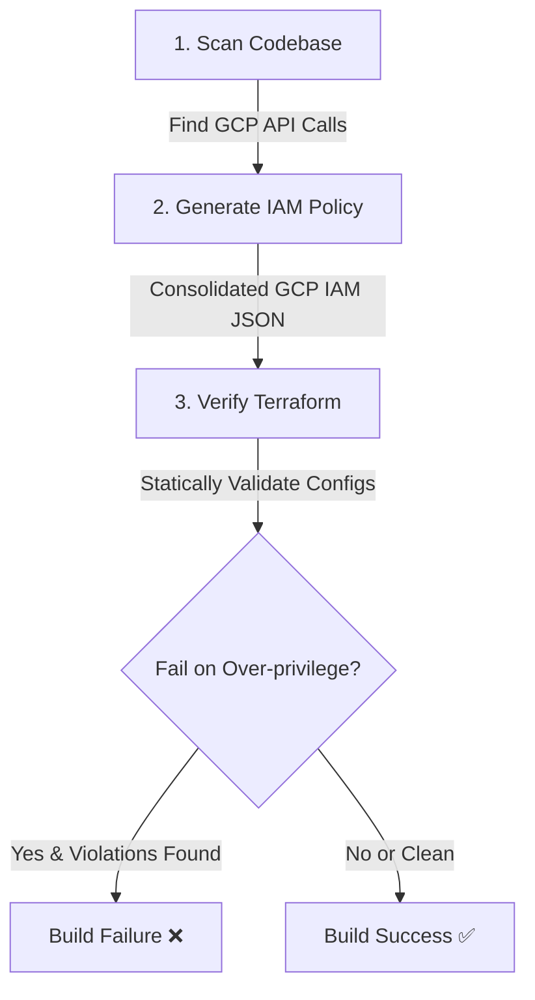

# IAM Policy Lens GitHub Actions

This directory contains pre-built **GitHub Actions** and automated workflows to integrate static IAM analysis and least-privilege verification into your CI/CD pipeline. 

By scanning application code for GCP client library invocations and statically analyzing infrastructure-as-code (Terraform), these actions help you ensure that permissions granted in Terraform match exactly what the application code requires, preventing over-privileged configurations before they ever merge.

---

## 🚀 Core Automation Workflows

The complete automated pipeline runs on every Pull Request targeting the `main` branch, executing the following steps:



1. **Scan**: Analyzes your Go, Python, or TypeScript application code to discover all active GCP client library API calls.
2. **Generate**: Automatically translates discovered API calls into a consolidated, minimal GCP IAM Allow Policy (`JSON` format).
3. **Verify**: Compares the generated least-privilege policy against the permissions declared in your Terraform configuration files (`.tf`), warning you or failing the build if your Terraform config is over-privileged.

---

## 📦 Custom Actions Catalog

We provide the following plug-and-play GitHub Actions in this directory:

### 1. Go Scanner (`analyze-go`)
Scans Go source files to identify Google Cloud API calls and outputs a JSON report of discovered GAPIC calls.

#### Inputs
| Name | Description | Required | Default |
| :--- | :--- | :---: | :--- |
| `target-path` | Path to the Go project/sub-directory to scan | No | `.` |
| `output-file` | Path to save the discovered GAPIC calls JSON report | No | `gapic-calls.json` |

#### Outputs
| Name | Description |
| :--- | :--- |
| `results-file` | Path to the raw GAPIC calls JSON file (resolves to `output-file` value) |

---

### 2. Python Scanner (`analyze-python`)
Scans Python source files for Google Cloud API invocations (supporting custom virtual environments for deep type-resolution) and outputs a JSON report.

#### Inputs
| Name | Description | Required | Default |
| :--- | :--- | :---: | :--- |
| `target-path` | Path to the Python project/sub-directory to scan | No | `.` |
| `python-environment` | Optional path to target Python virtual environment for Jedi type-resolution | No | `""` |
| `output-file` | Path to save the discovered GAPIC calls JSON report | No | `gapic-calls.json` |

#### Outputs
| Name | Description |
| :--- | :--- |
| `results-file` | Path to the raw GAPIC calls JSON file (resolves to `output-file` value) |

---

### 3. TypeScript Scanner (`analyze-ts`)
Compiles and runs the TypeScript-based AST analyzer to discover Google Cloud API calls and outputs a JSON report.

#### Inputs
| Name | Description | Required | Default |
| :--- | :--- | :---: | :--- |
| `target-path` | Path to the TypeScript project/sub-directory to scan | No | `.` |
| `output-file` | Path to save the discovered GAPIC calls JSON report | No | `gapic-calls.json` |

#### Outputs
| Name | Description |
| :--- | :--- |
| `results-file` | Path to the raw GAPIC calls JSON file (resolves to `output-file` value) |

---

### 4. Terraform IAM Verification (`terraform`)
Statically compares discovered API permission requirements against permissions declared in your Terraform configuration files (`.tf`), catching over-privileged access.

#### Inputs
| Name | Description | Required | Default |
| :--- | :--- | :---: | :--- |
| `tf-dir` | Path to the directory containing your Terraform (`.tf`) files | No | `.` |
| `policy-json` | Path to the consolidated Policy Lens JSON file (compiled from scanner step) | **Yes** | N/A |
| `gapic-calls` | Path to the raw GAPIC calls JSON (enables detailed inline PR annotations) | No | `""` |
| `fail-on-extra` | Fail the workflow run if extra (over-privileged) permissions are detected in Terraform | No | `false` |

---

### 5. PR Annotations & Step Summary (`reporter`)
This is a helper component invoked automatically by the Go, Python, and TypeScript scanners. 
- **Inline PR Annotations**: Pins warnings and comments directly to the lines of code making Google Cloud API calls.
- **Step Summary**: Generates a beautiful, interactive markdown table summarizing all discovered Google Cloud API calls in the GitHub Actions run view.

---

## 🛠️ Reference CI/CD Workflow

Create a file at `.github/workflows/verify_iam.yml` and populate it with the following configuration:

```yaml
name: Static IAM Least-Privilege Verification

on:
  pull_request:
    branches: [ main ]
  workflow_dispatch:

jobs:
  verify-iam:
    runs-on: ubuntu-latest
    steps:
      - name: Checkout Repository
        uses: actions/checkout@v4
        with:
          fetch-depth: 0  # Required to trace git diff for changed files

      # 1. Scan application source code to discover all Google Cloud API client calls
      - name: Run Python Scanner
        id: python-scan
        uses: ./actions/analyze-python
        with:
          target-path: 'gcp_cost_optimizer_agent/python'
          python-environment: 'gcp_cost_optimizer_agent/python/.venv'
          output-file: 'python-gapic-calls.json'

      # 2. Generate required GCP IAM Allow Policy JSON from discovered API calls
      - name: Generate Consolidated IAM Policy
        run: |
          python3 iam-policy-lens/scripts/policy/policy.py < python-gapic-calls.json --json > python-policy.json

      # 3. Run Static IAM Least-Privilege Verification against Terraform configs
      - name: Verify Terraform IAM least-privilege
        uses: ./actions/terraform
        with:
          tf-dir: 'gcp_cost_optimizer_agent/python/terraform'
          policy-json: 'python-policy.json'
          gapic-calls: 'python-gapic-calls.json'
          fail-on-extra: 'false' # Warning-only by default; set 'true' to enforce strict verification
```

> [!TIP]
> **Optimizing Scans**: To analyze multiple sub-directories or languages, simply add multiple scanner steps and pass their outputs into `policy.py` sequentially or merge the JSON outputs.

> [!IMPORTANT]
> The Terraform Verification action (`./actions/terraform`) parses your Terraform files statically to locate custom roles, bindings, and service account configurations, ensuring no unnecessary permissions are defined.
