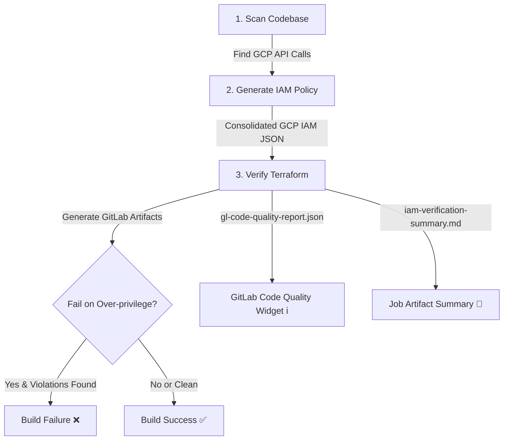

# IAM Policy Lens GitLab CI/CD

This directory contains pre-built scripts and configurations to integrate static IAM analysis and least-privilege verification into your **GitLab CI/CD** pipelines.

By scanning application code for GCP client library invocations and statically analyzing infrastructure-as-code (Terraform), this integration helps you ensure that permissions granted in Terraform match exactly what the application code requires, preventing over-privileged configurations before they are merged.

---

## 🚀 Core Automation Workflows

The complete automated pipeline runs on every Merge Request, commit to the default branch, or manual trigger, executing the following steps:



1. **Scan**: Analyzes your Go, Python, or TypeScript application code to discover all active GCP client library API calls.
2. **Generate**: Automatically translates discovered API calls into a consolidated, minimal GCP IAM Allow Policy (`JSON` format).
3. **Verify**: Compares the generated least-privilege policy against the permissions declared in your Terraform configuration files (`.tf`), flagging violations.
4. **Report**: Generates job artifacts and standard Code Quality reports so you can view warnings directly inline in the GitLab Merge Request UI.

---

## 🛠️ Reference CI/CD Configuration

Create a file at `.gitlab-ci.yml` in your repository root and populate it with the following configuration:

```yaml
stages:
  - verify

verify-iam:
  stage: verify
  image: python:3.11-slim
  variables:
    # Set GIT_DEPTH to 0 to pull the full git history.
    # This enables the scanner to trace git diffs for Merge Requests.
    GIT_DEPTH: 0
  before_script:
    - apt-get update && apt-get install -y git
    - pip install jedi
    - |
      if [ -f gcp_cost_optimizer_agent/python/requirements.txt ]; then
        echo "Installing application dependencies..."
        pip install -r gcp_cost_optimizer_agent/python/requirements.txt
      fi
  script:
    # 1. Scan Python source code to discover Google Cloud API client calls
    - python3 iam-policy-lens/scripts/python/analyzer.py gcp_cost_optimizer_agent/python gcp_cost_optimizer_agent/python/.venv > python-gapic-calls.json
    
    # 2. Generate required GCP IAM V3 Allow Policy JSON from discovered API calls
    - python3 iam-policy-lens/scripts/policy/policy.py < python-gapic-calls.json --json > python-policy.json
    
    # 3. Run Static IAM Least-Privilege Verification against Terraform configs
    # This generates the standard CodeClimate JSON report for inline MR annotations, and a markdown summary
    - python3 actions/terraform/verify_iam_gitlab.py 
        --tf-dir gcp_cost_optimizer_agent/python/terraform 
        --policy-json python-policy.json 
        --gapic-calls python-gapic-calls.json
  artifacts:
    name: iam-verification-report
    when: always
    paths:
      - python-gapic-calls.json
      - python-policy.json
      - gl-code-quality-report.json
      - iam-verification-summary.md
    expose_as: "IAM Policy Lens Reports"
    reports:
      codequality: gl-code-quality-report.json
  rules:
    # Trigger automatically on Merge Requests
    - if: $CI_PIPELINE_SOURCE == "merge_request_event"
    # Trigger manually via the GitLab web UI
    - if: $CI_PIPELINE_SOURCE == "web"
    # Trigger on commits to the main/default branch
    - if: $CI_COMMIT_BRANCH == $CI_DEFAULT_BRANCH
```

---

## 💻 Local Installation & Testing Process

Testing GitLab CI configurations locally saves significant time and avoids repetitive debugging commits. Below is the modern, container-backed local testing guide for macOS.

### 1. Install Prerequisites

To run the pipeline on your local machine, you need **`gitlab-ci-local`** and a local container runtime.

#### A. Install `gitlab-ci-local`
Install the modern replacement for the deprecated `gitlab-runner exec` command:
```bash
brew install gitlab-ci-local
```

#### B. Install a Container Engine (Colima & Docker CLI)
We recommend **Colima** as a fast, open-source, CLI-only alternative to Docker Desktop:
```bash
# Install Colima and the Docker CLI
brew install colima docker

# Start the background VM daemon
colima start
```

---

### 2. Execute the CI Job Locally

Once your container engine is started, you can run the job in two different modes:

#### Mode A: Container Execution (Recommended)
This executes the job inside the exact `python:3.11-slim` image declared in the `.gitlab-ci.yml` file. This guarantees complete environment fidelity:
```bash
gitlab-ci-local verify-iam
```

#### Mode B: Host Shell Execution (No Docker)
If you need to run the job directly on your macOS host shell (without spinup overhead or Docker running), you can force the local runner to bypass Docker:

> [!CAUTION]
> When running on the host shell, commands like `apt-get` will fail since they are Linux-only. You should ensure your local Python virtual environment is active before executing.

```bash
# 1. Activate your local virtual environment
source .venv/bin/activate

# 2. Force the host shell execution
gitlab-ci-local verify-iam --force-shell-executor
```

---

### 3. Review Locally Generated Artifacts

After a successful run, the generated files are collected inside the `.gitlab-ci-local/artifacts/verify-iam/` directory:
* **`python-gapic-calls.json`**: The raw list of discovered Google Cloud API calls.
* **`python-policy.json`**: The minimal computed GCP IAM Allow Policy.
* **`gl-code-quality-report.json`**: The CodeClimate JSON report that GitLab reads to display inline widgets in MRs.
* **`iam-verification-summary.md`**: A human-readable summary of the verification run.
